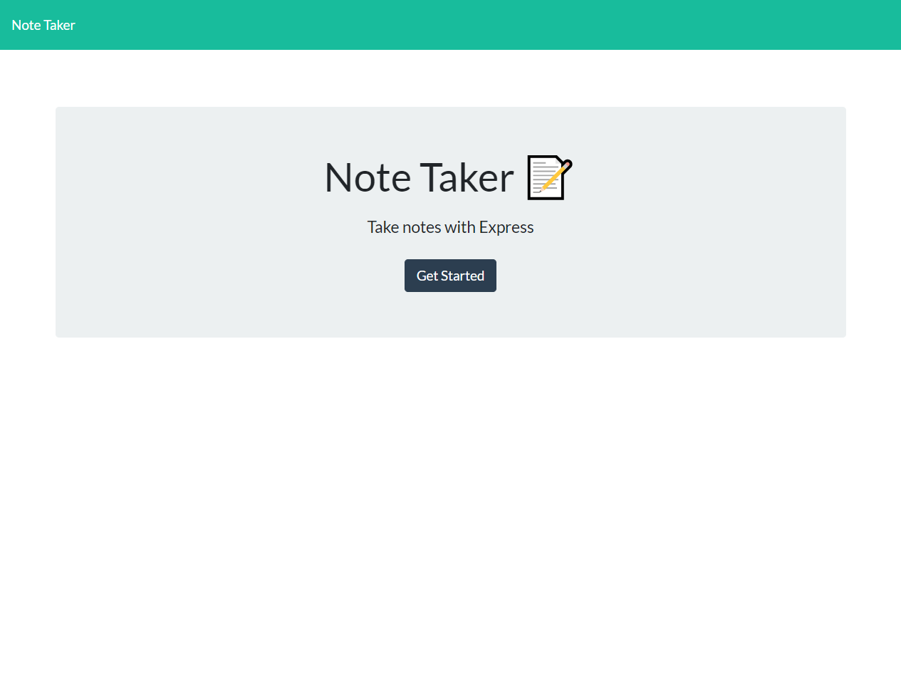
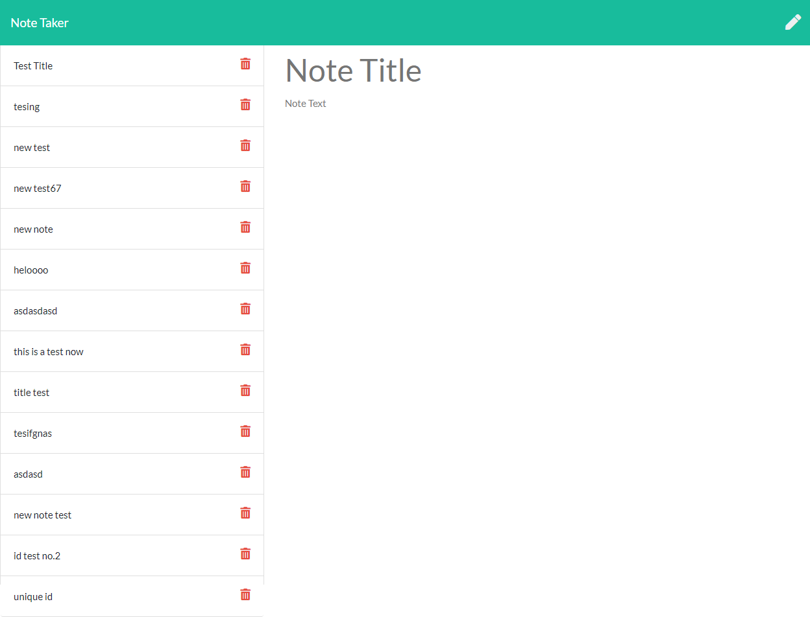
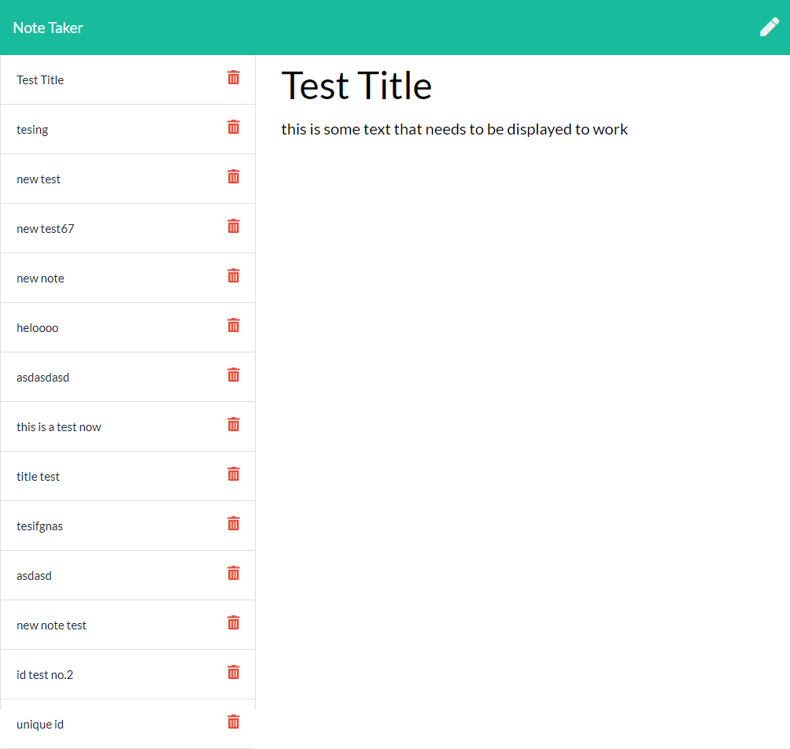

# Note Taker

## Licence

## Description

My motivation for this project was: I needed a place to store notes for my day / week.

I built this project because To increase my organisation when it comes to work and study.

This project solves the following problem Missing any tasks throughout the week.

From this project I learnt Express is great to use when you get the hang of it. Heroku is also an amazing tool.

## Contents

-   [Installation](#installation)
-   [Licence](#licence)
-   [Features](#features)
-   [Contributions](#contributions)
-   [Questions](#questions)

## Installation

To install this project download the code from the repo.

## Live Link

[Deployed App](https://dry-woodland-40974.herokuapp.com/)

## Features

-   Express Js.
-   Note Taker.
-   JSON DB.
-   Unique Ids.

## Screenshots

-   
-   
-   

## Dependencies

To install dependencies run:
`npm install`

## Testing

To run tests use the command:
`no tests for this project`

## Contributions

No contributions at this moment :).

## Questions

-   Contact me via [GitHub](https://github.com/lewy192)
-   Contact me via [Email](mailto:lewis.james.hill@outlook.com)

## Acknowledgements

-   [w3schools](https://www.w3schools.com/)
-   [StackOverflow](https://stackoverflow.com/)
